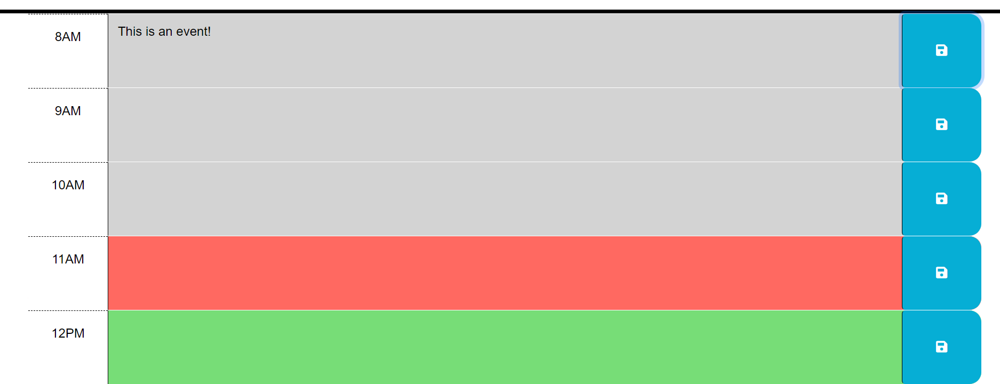
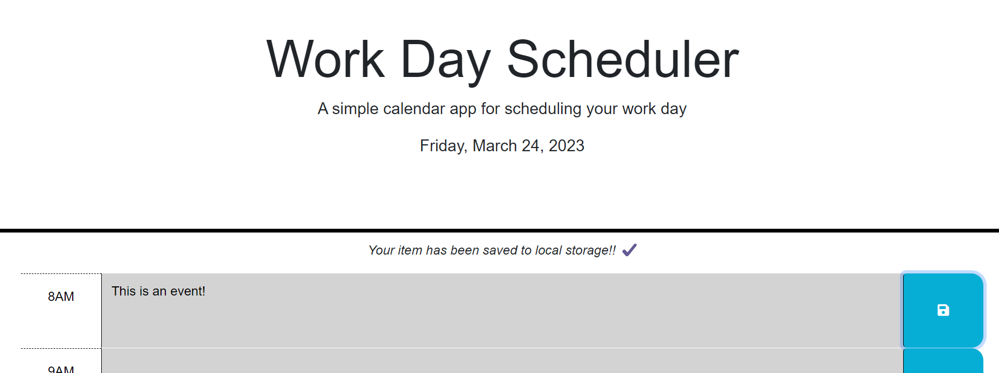

# Calendar-Project

## Description
Daytime calendar application to store events. This application was created to assist users in organizing their daytime activities. With this application, users can easily sort their events into past, present, or future depending on the time of day the calendar is viewed. 

## Installation
N/A

## Usage
To view the depolyed application click [here.](https://shannonkprice00.github.io/Calendar-Project/)

The calendar contains 1 hour time blocks from 8am to 8pm which dynamically change color based on if the time block is in the past, present hour, or future of the users current time. The user can input text and click on the save button which will display a confirmation of save message at the top of the time blocks. The application saves any text to local storage so when refreshing the page, or reloading the page, the user will still have their events in place. 

Color Coded Hours Based On Time  
  

Confirmation of Save Demonstration  

## Credits
For Each Assistance: Tutor Trinh Nguyen 
For Loop Assistance: Learning Assistant Skaliaperumal 
Tutorials Followed: 
[DOM Traversal](https://api.jquery.com/category/traversing/tree-traversal/) 
[Appending items in jQuery](https://api.jquery.com/append/) 

## License
MIT License